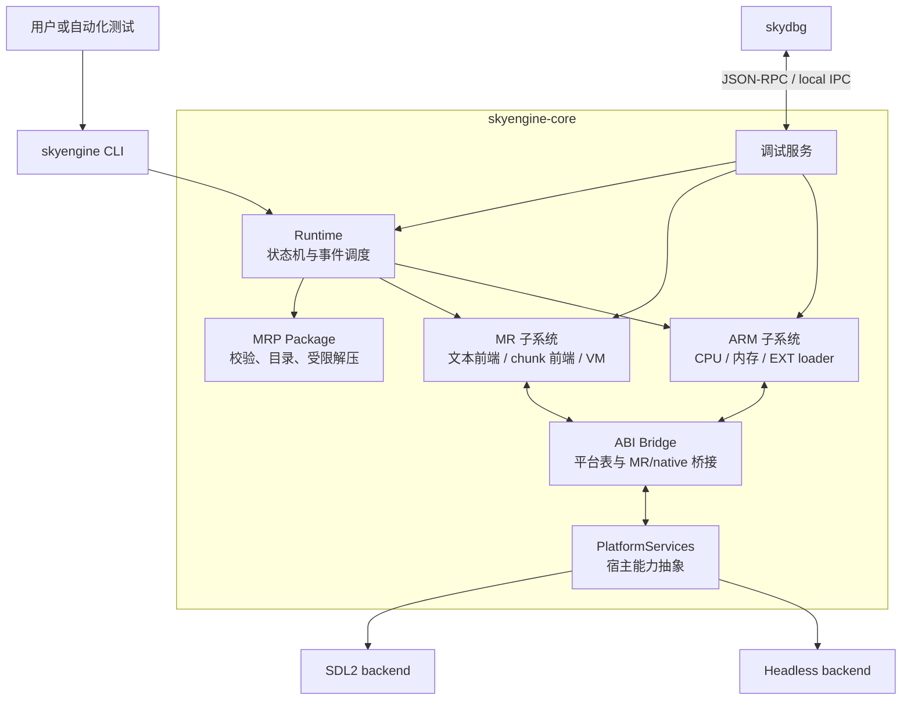
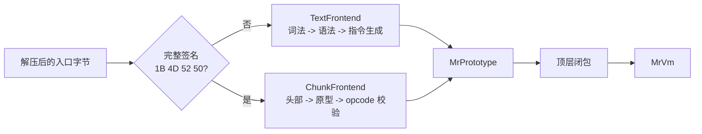
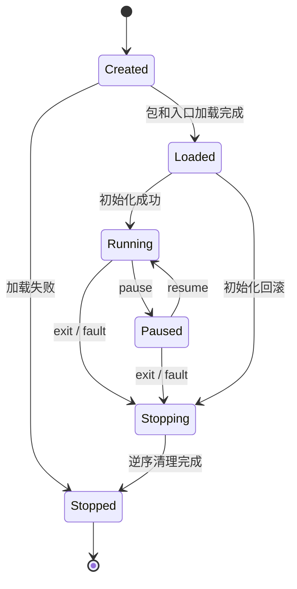

# SkyEngine v2 设计文档

## 1. 文档定位

SkyEngine v2 是一个从零实现的 MRP 应用兼容运行时。它负责读取 MRP 包，执行
MR 文本或预编译字节码，装载包内的 ARM/Thumb EXT 模块，并在现代宿主系统上
提供显示、输入、文件、网络、音频和调试能力。

本文面向实现者和维护者，描述项目尚未实现时的目标架构、模块边界、关键不变量
和交付顺序。当前仓库中的占位构建文件和示例程序不构成技术选型约束。

MRP 的外部格式和 ABI 事实由以下文档定义：

- [MRP 兼容性资料](mrp/README.md)
- [MRP 容器格式](mrp/container-format.md)
- [MR 语言与虚拟机](mrp/mr-language-vm.md)
- [MRP 启动与执行模型](mrp/execution-model.md)
- [ARM 平台与 EXT ABI](mrp/arm-abi.md)
- [Mythroad 平台函数表](mrp/platform-table.md)
- [事件、按键与公共值](mrp/events-and-values.md)

上述文档记录 guest 可观察的兼容事实；本文记录 SkyEngine 自己的实现选择。实现
不得把某个历史运行时的源码组织、内部对象或针对单个应用的补丁当作规范。

## 2. 目标与非目标

### 2.1 项目目标

SkyEngine v2 应当：

1. 安全读取不可信 MRP 包，保留目录和入口选择所需的完整信息。
2. 支持文本 MR 和预编译 MR chunk，并由同一套 MR VM 执行。
3. 使用纯 Rust 解释器执行 MRP 中的 ARM/Thumb 原生 EXT。
4. 支持纯 MR、直接 EXT、MR 启动 EXT，以及父子 EXT 等执行形态。
5. 以明确的 SDK、MR 和 ISA profile 管理版本差异，不进行猜测式兼容。
6. 在 Linux 和 Windows 上提供 SDL2 图形前端，并提供无头测试后端。
7. 为文件、网络、计时器、音频和平台 UI 提供可替换的宿主服务。
8. 提供覆盖 MR VM 和 ARM CPU 的统一调试、诊断和性能分析入口。
9. 对失败、资源耗尽、未支持格式和 guest 故障给出确定且可诊断的结果。

### 2.2 非目标

SkyEngine v2 首期不负责：

- 模拟完整手机硬件、基带或通用 ARM 操作系统；
- 在宿主 CPU 上直接执行 MRP 中的 ARM 机器码；
- 实现 JIT 编译器；
- 兼容某个旧运行时的内部 API、内存地址或源码结构；
- 为了启动单个应用而加入无法推广、无法验证的程序特判；
- 默认执行真实短信发送或电话呼叫等外部副作用。

## 3. 技术决策

### 3.1 语言与依赖

核心运行时使用 Rust。MR 前端、MR VM、ARM CPU、guest 内存、模块加载、平台
抽象和调试核心都应由 Rust 实现。SDL2、音频编解码等成熟系统库可以通过边界
清晰的 FFI 封装使用；不允许 guest 地址或宿主裸指针跨越安全接口。

生产环境的 ARM 执行不依赖 Unicorn、QEMU 或其他 CPU 模拟器。外部模拟器可以
作为测试阶段的差分 oracle，但不能成为发布产物的运行时依赖。

### 3.2 支持平台

首发宿主平台为 Linux 和 Windows。核心库不依赖 SDL 事件循环或特定窗口系统，
因此可以由以下后端复用：

- SDL2 桌面后端：窗口、输入、音频和真实时钟；
- headless 后端：确定性 framebuffer、虚拟时钟和输入注入；
- 后续后端：macOS、Android、Web 或嵌入到其他应用中的库接口。

### 3.3 兼容策略

版本差异由显式 profile 表达：

- `MrProfile`：文本方言、chunk 头部、opcode 表和数值格式；
- `IsaProfile`：ARM/Thumb 指令集和字节序；
- `SdkProfile`：标准库、生命周期路由、平台表及厂商扩展。

初始目标为常见 MR 文本方言、`0x50` MR chunk、小端 ARMv5TE A32 + Thumb-1，
以及文档所述的 150 槽平台表基线。新增版本必须增加独立 profile 和测试，不能
把未知版本、opcode 或平台命令静默映射到“最接近”的已有行为。

## 4. 总体架构



### 4.1 目标工程边界

项目初期采用精简的 Cargo workspace：

```text
crates/
  skyengine-core/    MRP、MR VM、ARM、ABI、运行时、平台 trait、调试核心
  skyengine-sdl/     SDL2 平台实现
apps/
  skyengine/         inspect/run 命令行程序
  skydbg/            调试客户端
```

`skyengine-core` 内部先按职责分成模块，而不是立即拆成大量 crate。只有当依赖方向、
独立测试或多宿主复用确实需要时，才把模块提升为独立 crate。

### 4.2 核心不变量

1. MR VM、ARM CPU、guest 内存和模块表只有运行时线程可以修改。
2. guest 中的地址始终是受检查的 32 位值，不能直接转成宿主指针。
3. MR 对象堆与 ARM guest 地址空间相互独立，只通过明确的桥接接口交换数据。
4. 同一应用事件在同一层级只能有一个消费者，不能同时广播给 MR 和 native helper。
5. 所有输入长度、偏移、计数和地址运算都必须在分配或访问前检查。
6. 未知格式、指令、槽位或命令必须显式失败，不能当作空操作或成功。
7. 部分初始化也必须拥有完整的逆序清理路径。
8. 不可信 guest 错误不能导致宿主 panic、越界访问或跨应用资源泄漏。

## 5. 配置与公开命令

### 5.1 命令行

首期公开命令为：

```text
skyengine inspect [--json] <app.mrp>

skyengine run [options] <app.mrp>
  --entry <name>
  --work-dir <dir>
  --memory <size>
  --screen <width>x<height>
  --sdk-profile <id>
  --mr-profile <id>
  --isa-profile <id>
  --deny-network
  --debug-listen <endpoint>

skydbg connect <endpoint>
```

`inspect` 只解析和报告包信息，不执行 guest。`run` 创建独立应用工作区和运行时。
### 5.2 运行时配置

配置在进入运行时后不可被无约束地全局修改。核心概念接口如下：

```rust
pub struct RuntimeConfig {
    pub entry: Option<Vec<u8>>,
    pub work_dir: PathBuf,
    pub memory_limit: u32,
    pub screen: ScreenConfig,
    pub sdk_profile: SdkProfileId,
    pub mr_profile: Option<MrProfileId>,
    pub isa_profile: IsaProfileId,
    pub network: NetworkPolicy,
    pub limits: ResourceLimits,
    pub debug_endpoint: Option<DebugEndpoint>,
}
```

明确的命令行或嵌入方配置优先级最高。预编译 chunk 的完整签名和版本可以选择对应
`MrProfile`；文本 MR、SDK 和 ISA 无法可靠自动判断时使用调用者指定的 profile 或
文档化的基线，不能依据单个 opcode 或应用文件名反复猜测。

## 6. MRP 包与资源层

### 6.1 包模型

`Package` 是经过范围校验的不可变包视图。它应保存：

- 包头的原始字段和经过校验的数值；
- 目录项原始顺序；
- 重名文件的全部条目，而不是覆盖后的 map；
- 原始文件名字节和单独的 UI 解码结果；
- payload 的包内偏移、保存长度、压缩状态和解压后长度；
- 解析过程中产生的非致命诊断。

包解析器只负责格式、范围和内容读取，不负责选择 `start.mr`、映射 EXT、调用入口
或初始化子模块。这些操作属于运行时和 loader。

### 6.2 受限读取与解压

读取 payload 的固定顺序为：

```text
校验目录项范围
  -> 读取声明的 stored bytes
  -> 检查 gzip 签名
  -> 在输出上限内流式解压
  -> 验证压缩流完整结束
  -> 把结果交给 MR 或 EXT 内容识别
```

包总长、目录项数、单项名称、单文件保存长度、解压输出和累计资源占用都受
`ResourceLimits` 约束。整数加法和乘法必须使用 checked 运算。任何超限都返回明确
错误，不允许部分截断后继续执行。

### 6.3 入口选择

入口选择由 `RuntimeConfig`、`SdkProfile` 和包目录共同完成：

1. 如果调用者明确指定入口，按 profile 定义的名称比较规则查找。
2. 否则使用 profile 的默认入口，通常为 `start.mr`。
3. 遇到重名入口时执行 profile 的确定规则；没有规则时报告歧义。
4. 不因文件名推断内容一定是文本 MR、chunk 或 ARM EXT。

## 7. MR 语言与虚拟机

ARM CPU 不执行 MR 字节码。MR 文本和预编译 chunk 由独立 MR 子系统处理，只有
进入 EXT 后才切换到 ARM 调用约定。

### 7.1 双前端



内容检测发生在容器解压之后。只有完整 MR chunk 签名和受支持的版本才能进入
`ChunkFrontend`；不能只检查首字节 `0x1B`。未知版本直接返回
`UnsupportedMrVersion`。

`TextFrontend` 直接处理原始字节：关键字和运算符按 ASCII 识别，字符串常量保留
原始字节。词法分析前不得无条件转成 UTF-8，也不能通过替换 `def`、`elif`、`&&`
等符号后交给现代 Lua 解析器。

两个前端实现同一加载契约：

```rust
pub trait MrFrontend {
    fn load(
        &self,
        input: &[u8],
        profile: &MrProfile,
        limits: &ResourceLimits,
    ) -> Result<Arc<MrPrototype>, MrLoadError>;
}
```

### 7.2 函数原型和指令

`MrPrototype` 至少包含：

- 来源、行号和其他可选调试信息；
- 固定参数数目、变参标记和寄存器数；
- 常量、局部变量范围和 upvalue 描述；
- 嵌套函数原型；
- 经过 profile 解码的 32 位寄存器式指令。

chunk loader 在执行前验证数量、字符串长度、嵌套深度、寄存器范围、常量和原型
索引、upvalue 索引、跳转目标以及 `Bx/sBx`。opcode 必须在当前 profile 的表中有
精确定义；未知 opcode 不能作为 NOP 执行。

统一指令表示用于共享 VM，不得抹掉版本相关语义。确有语义差异的操作由 profile
选择不同指令或语义处理器，而不是在 VM 中散布应用名称判断。

### 7.3 值与调用帧

```rust
pub enum MrValue {
    Nil,
    Boolean(bool),
    Number(f64),
    Bytes(GcRef<MrString>),
    Table(GcRef<MrTable>),
    Closure(GcRef<MrClosure>),
    PlatformFunction(PlatformFunctionId),
    Userdata(UserdataHandle),
    Thread(GcRef<MrThread>),
}
```

MR VM 是寄存器式解释器。每个调用帧保存当前原型、PC、虚拟寄存器、返回位置、
期望结果数量、变参区和打开的 upvalue。尾调用、协程切换和 yield 必须显式更新
状态，不能依赖宿主语言调用栈保存 guest 语义。

`number` 的初始 profile 使用双精度浮点数。字符串是带长度的字节序列，可以包含
NUL，也不保证是 UTF-8。只有目标平台函数要求 C 字符串时，桥接层才创建经过范围
检查的临时 NUL 结尾缓冲区。

### 7.4 MR 对象堆与 GC

MR 对象使用稳定句柄，首期采用非移动 tracing mark-and-sweep。根集合至少包括：

- 全局环境和注册表；
- 活动及挂起的调用帧；
- 闭包和打开的 upvalue；
- 活动协程；
- 平台层合法持有的 userdata 和待完成异步操作。

GC 只在运行时安全点执行。关闭 upvalue、取消异步操作和销毁 userdata 都必须发生
在运行时线程；应用停止后不得回调已经释放的闭包、线程或 userdata。

### 7.5 标准库和生命周期

标准库由 `SdkProfile` 的能力清单注册，并区分：

- MR/Lua 家族共有的语言能力；
- Mythroad 修改过的名称、参数和返回值；
- 绘图、声音、文件、网络、计时器和 EXT 装载等 MRP 能力；
- SDK 或厂商扩展；
- 由宿主安全策略提供的真实、模拟或禁用能力。

执行 `start.mr` 顶层代码后，运行时按 profile 查找 `dealevent`、`dealtimer`、
`suspend` 和 `resume` 等可选回调。回调不存在时按 profile 忽略或转交 native 路径。
如果 MR 已把事件转交给 helper，运行时不得再次直接向同一 helper 投递该事件。

### 7.6 执行结果

MR VM 每轮最多执行给定预算的指令，并返回：

```rust
pub enum VmOutcome {
    Yielded,
    Waiting(OperationId),
    Returned(Vec<MrValue>),
    Exited(i32),
    Fault(MrFault),
}
```

协程主动 yield、平台异步等待和预算耗尽是不同原因，诊断信息必须能够区分它们。

## 8. ARM/Thumb 解释器与 EXT

### 8.1 CPU 模型

`ArmCpu` 保存 R0-R15、CPSR、执行 profile 和待处理故障。首期实现小端 ARMv5TE
A32 与 Thumb-1，并准确处理：

- 条件执行和 N/Z/C/V 标志；
- ARM/Thumb 状态切换及函数指针 bit 0；
- PC 读写和分支/链接语义；
- load/store 对齐和符号扩展；
- profile 明确包含的乘除、移位、饱和或 DSP 指令；
- 软件中断、未定义指令和内存故障。

经过验证的 ARMv6 或 Thumb-2 指令通过新的 `IsaProfile` 增加。遇到未支持指令时
返回包含模块、PC、原始 opcode、ARM/Thumb 状态和寄存器摘要的
`UnsupportedInstruction`，不能尝试跳过。

### 8.2 解释执行与缓存

CPU 使用 fetch/decode/execute 循环。允许将指令预解码为内部操作，并缓存顺序基本
块以降低分派开销，但仍保持解释执行。任何 guest 对可执行页的写入都必须使重叠的
预解码或基本块缓存失效。

每次 `run` 接收指令预算和停止条件。断点、平台调用、生命周期退出、预算耗尽和
guest fault 都必须在有限步数内把控制权交还给运行时。

### 8.3 Guest 地址空间

所有 guest 地址使用独立类型：

```rust
#[repr(transparent)]
pub struct GuestAddr(u32);
```

`GuestMemory` 提供检查式的 map、unmap、read、write 和 fetch API。每个 region 记录
用途、所有者及 R/W/X 权限。至少区分代码、只读数据、模块 RW、栈、堆、平台表、
共享 framebuffer 和桥接缓冲区。

所有 `address + length`、页对齐和范围包含判断都先在更宽整数中检查。guest 指针
不能通过 `as` 转成宿主指针；即使底层使用连续 backing memory，也只能通过
`GuestMemory` 的借用范围访问。

### 8.4 EXT 模块

解压后的 EXT 必须校验 `MRPGCMAP` 等当前 profile 要求的映像标记。loader 建立代码、
RW 和栈映射后，从 profile 定义的入口执行，常见入口为映像偏移 `+8`。

```rust
pub struct ModuleContext {
    pub id: ModuleId,
    pub parent: Option<ModuleId>,
    pub state: ModuleState,
    pub code_range: GuestRange,
    pub rw_range: GuestRange,
    pub stack_range: GuestRange,
    pub static_base_r9: GuestAddr,
    pub isa_profile: IsaProfileId,
    pub helper: Option<GuestFunction>,
}
```

wrapper、game EXT 和插件拥有独立上下文。跨模块调用必须保存和恢复 PC、SP、LR、
CPSR、R9，以及 ABI 要求保持的其他寄存器。子模块停止后，其 helper、回调、异步
操作和 guest 地址立即失效。

### 8.5 平台表桥接

平台表的每个槽在 profile 中显式声明为函数、数据、子表或保留项。函数槽指向
guest 可见的受控 veneer/trap 地址；CPU 到达该地址时由 ABI dispatcher：

1. 确认当前模块和调用状态有效；
2. 按槽位签名读取寄存器及栈参数；
3. 校验每个 guest 缓冲区、字符串和二级指针；
4. 调用 `PlatformServices`；
5. 把结果写回 guest，并恢复正确的返回状态。

数据槽保持 guest 地址和间接层级，不能注册为宿主函数指针。保留槽保持为零；真实
未实现且没有模拟 provider 的能力必须返回 profile 规定的失败结果。

## 9. 运行时与调度

### 9.1 生命周期状态机



| 状态 | 允许的主要操作 | 约束 |
|---|---|---|
| Created | 解析配置、加载包 | 不可投递应用事件 |
| Loaded | 初始化、卸载 | helper 尚未必可调用 |
| Running | 事件、计时器、异步完成、子模块加载 | guest 调用必须串行 |
| Paused | 恢复、退出、必要的系统完成事件 | 普通输入和应用计时器按 profile 抑制 |
| Stopping | 取消异步操作、执行清理 | 不得创建新的 guest 工作 |
| Stopped | 查询最终诊断 | 不得再次调用 guest 地址 |

### 9.2 启动流程

```text
读取 RuntimeConfig
  -> 验证并建立 Package
  -> 选择入口及 profile
  -> 创建平台实例、资源账本和运行时队列
  -> 识别入口内容
       -> 文本/预编译 MR：创建顶层闭包并执行
       -> 直接 EXT：建立模块映射并调用入口
  -> 可选：MR 请求装载 cfunction.ext
  -> helper 初始化
  -> Running 事件循环
```

每个阶段只把完全初始化的资源提交给运行时。在提交之前由加载 guard 持有临时资源；
任何错误都会自动逆序释放映射、句柄、回调、异步操作和平台对象。

### 9.3 事件循环和并发

MR VM、ARM CPU、guest memory、模块表和屏幕提交由同一个运行时线程拥有。其他线程
只能产生消息：

```text
SDL / worker / debug thread
  -> bounded RuntimeEvent queue
  -> runtime validates owner and generation
  -> dispatch to MR callback or native helper
  -> run with instruction budget
  -> collect PlatformResult and render damage
```

网络、DNS、文件异步操作和宿主 UI 使用 `OperationId`。操作同时绑定应用 generation、
模块和回调目标；模块停止或应用重启时先取消操作，迟到结果因 generation 不匹配而
丢弃。工作线程不能直接进入 MR VM 或 ARM CPU。

应用 restart 是调度边界上的冷替换，不是 guest 调用栈的暂停和续执行。目标包、入口
和需要迁移的平台会话数据必须在提交前全部验证并捕获；提交后销毁旧 MR/ARM/EXT
执行态，创建新应用 generation，再于 guest 入口前导入会话数据。返回身份栈中的父
应用也执行同样的冷启动流程，不能恢复旧 PC、调用帧、guest 指针或待完成 native 调用。

计时器以单调时钟调度，设备日期与单调时间分开。headless 后端使用可推进的虚拟时钟，
保证单元和端到端测试不依赖真实等待。

### 9.4 重入规则

guest 调用平台函数期间不得同步重入同一个 guest。需要回调的操作返回
`PlatformResult::Pending(OperationId)`，随后由事件队列投递。确实同步完成的纯函数
可以返回 `PlatformResult::Ready(value)`，但仍不能在平台调用栈中触发另一个 MR 或
ARM 入口。

## 10. 平台服务

### 10.1 能力边界

`PlatformServices` 按能力拆分为可组合接口：

- display、输入和文本输入；
- 文件、目录和应用工作区；
- 单调时间、设备日期和计时器；
- DNS、socket 和更高层网络适配；
- 音频播放、停止和音量策略；
- 菜单、对话框、文本查看器和编辑框；
- 设备信息、随机数和平台命令；
- EXT 读取、装载和资源访问；
- 短信、呼叫等外部动作 provider。

ABI dispatcher 依赖这些抽象，而不依赖 SDL2 或宿主原生句柄。平台句柄使用带类型
和 generation 的宿主管理表，再映射为 guest 可见整数。

### 10.2 显示与输入

运行时维护 profile 定义的 guest framebuffer 格式。SDL2 后端把脏区域转换为宿主
纹理并提交，窗口缩放不改变 guest 分辨率。鼠标和触摸坐标先逆变换到 guest 画布，
超出画布的输入按配置裁剪或忽略。

键盘输入先规范化为 MRP 按键编号，再按顺序投递 PRESS/RELEASE。文本输入走独立的
编辑或剪贴板路径，不能伪装成一串未配对的按键。headless 后端必须提供帧快照、绘制
计数和确定性输入注入。

### 10.3 文件沙箱

所有应用文件访问限制在独立 `work_dir`：

1. guest 路径先按 profile 解码和规范化；
2. 拒绝绝对路径、根前缀和越过根目录的 `..`；
3. 打开前验证解析后的父目录和符号链接不会逃逸；
4. guest 只持有运行时文件句柄，不能得到宿主 fd 或 HANDLE；
5. 应用停止时关闭所有仍登记的文件和目录枚举句柄。

文件创建、截断和共享标志必须按 `SdkProfile` 解释，不能直接透传为宿主 flags。

### 10.4 音频

音频能力通过独立的 `PlatformAudio` 接口注入运行时，与显示和输入后端分离。核心把
内存 MIDI 和 MP3 解码为 44.1 kHz、双声道、S16LE PCM，并统一维护当前音轨、循环、
停止和 `0..5` 音量状态。解码后的音频长度、MP3 工作集、MIDI 事件数和同时发声数均
有固定上限，畸形或超限资源不得造成无界分配。

SDL 后端由音频回调消费 PCM；Flutter/C ABI 后端通过
`skyengine_api_audio_render_s16le` 拉取同一格式。应用替换、退出或显式停止时清除当前
音轨。headless 后端注入 `SilentAudio`，接受已验证的 guest 请求但不解码、不播放，
从而保持现有自动化测试的确定性。

### 10.5 网络和外部副作用

网络默认开放，可使用 `--deny-network` 或嵌入方策略关闭。所有 socket 和 DNS 操作
受句柄数、缓冲区、超时和待完成操作数量限制，回调只能投递给仍存活的所有者。

短信和呼叫由内部固定 ABI adapter 处理。headless 模拟能力不是“未实现后伪造成功”，
也不接受调用侧的一次性放行参数：

- 不调用任何真实宿主短信或电话 API；
- 只对内部 ABI 白名单返回 adapter 固定的成功值或成功事件；
- 不在测试或 CLI 中暴露“下一次操作”授权或按调用放行开关。

其他没有真实实现、没有 mock provider、也没有 profile 失败语义的能力必须报告
`UnsupportedPlatformCapability`，不能默认返回零或成功。

`legacy-callback-v1` 是迁移期 ABI adapter，不是完整支付实现。adapter 只检查调用进入
原模块通过平台槽 131 登记且仍有效的动态执行区，并要求请求完整匹配 44 字节结构、
内部动作类型白名单和有界字符串。callee 与 callback 必须属于同一个动态映像，返回
地址必须仍属于原模块；匹配后先返回该 ABI 的“已接受”值，再把成功回调排入有固定
上限的运行时事件队列。回调使用请求时捕获的静态基址，不能在 guest 调用栈内同步
重入。adapter 不接受宿主调用方另行传入的模块号、函数地址、ID 或单次授权参数；
guest ABI 记录内的 callback 和 ID 只做边界与归属校验，不作为宿主授权或路由键。
adapter 也不能通过包名、绝对 PC、画面像素或应用对象偏移推断成功。

## 11. 调试与可观测性

### 11.1 调试传输

调试服务使用 JSON-RPC 2.0 over local IPC。Linux 使用仅当前用户可访问的 Unix
domain socket，Windows 使用具有当前用户 ACL 的 named pipe。默认不监听 TCP。

调试协议至少提供：

- `runtime.pause`、`runtime.resume` 和 `runtime.status`；
- `target.step`、`target.continue` 和 `target.interrupt`；
- `breakpoint.set`、`breakpoint.remove` 和 `breakpoint.list`；
- `mr.frames`、`mr.registers`、`mr.globals`、`mr.upvalues` 和 `mr.threads`；
- `arm.registers`、`memory.read`、`memory.write` 和 `module.list`；
- `event.list`、`trace.configure`、`profile.snapshot` 和 `log.subscribe`。

服务端通知至少包括 `stopped`、`moduleLoaded`、`moduleUnloaded`、
`lifecycleChanged`、`log`、`fault` 和 `operationCompleted`。

### 11.2 调试地址

断点地址必须带执行域：

```text
mr:<prototype-id>:<instruction-pc>
arm:<module-id>:<guest-address>
```

MR 指令地址始终可用。文本前端应生成字节偏移和行号映射，以支持源码行断点；预编译
chunk 缺少调试字段时只能使用指令 PC，不能伪造源码位置。

内存写入只在暂停状态允许，并经过普通 guest 权限和范围校验。对可执行内存的调试
写入同样触发 ARM 解码缓存失效。

### 11.3 日志和性能统计

结构化日志包含时间、应用 generation、模块、执行域、PC、事件和错误链。默认日志
不得输出完整短信号码、用户输入、网络凭据或任意 guest 缓冲区。

性能统计至少覆盖：

- MR 和 ARM 指令数、执行时间及预算耗尽次数；
- opcode/基本块热度和 ARM 解码缓存命中率；
- MR 堆、GC 次数和停顿；
- guest 内存各 region 的占用；
- 平台调用、异步操作和事件队列等待；
- framebuffer 转换与提交耗时。

## 12. 错误、限制与安全

### 12.1 错误分类

顶层错误保持来源和上下文，不压缩成单一 `-1`：

| 类别 | 示例 | 处理方式 |
|---|---|---|
| Package | 魔数错误、越界目录、解压超限 | 拒绝加载 |
| MR load | 未知版本、非法原型、未知 opcode | 拒绝入口 |
| MR fault | 类型错误、非法索引、栈/寄存器越界 | 停止当前调用或应用 |
| ARM fault | 未映射访问、权限错误、未支持指令 | 停止当前模块或应用 |
| ABI | 无效槽位、guest 指针、长度或句柄 | 返回 ABI 错误并记录诊断 |
| Platform | I/O、网络、SDL 或音频失败 | 按 profile 返回或停止能力 |
| Resource | 内存、句柄、队列或指令预算超限 | 可恢复 yield 或确定失败 |
| Internal | 违反运行时不变量 | 安全停止并保留诊断 |

对 guest 可见的返回值由 ABI/profile 转换；宿主内部仍保留结构化错误链、模块 ID、
PC 和原始输入位置。

### 12.2 资源限制

`ResourceLimits` 集中管理所有上限，至少包括：

- 包长度、目录项和名称长度；
- 单项保存长度、解压长度和累计解压量；
- MR 原型嵌套、常量、指令、寄存器、调用深度和协程数；
- MR 对象堆、ARM guest 内存、模块数和单模块栈；
- 文件、目录枚举、socket、计时器、异步操作和平台 UI 句柄；
- 事件队列、日志速率、单轮 MR/ARM 指令和单帧处理时间。

profile 可以在全局安全上限内选择更小的设备档位，不能提高进程级硬上限。所有默认值
必须在发布前文档化，并通过边界值和超限测试；任何集合或读取流程都不能无界增长。

### 12.3 确定性与可恢复性

headless 后端允许注入虚拟时钟、设备日期、随机种子和网络响应。外部动作结果只由内部
固定 ABI adapter 决定；CLI、`RuntimeConfig`、嵌入方和 E2E 不得按运行、
按调用或按“下一次动作”注入结果或授予权限。相同输入与配置应得到相同事件顺序和
framebuffer 输出。

应用 fault 后不继续执行未知状态的 guest。运行时先冻结事件生产，再取消异步操作，
逆序卸载子模块、主 EXT、MR VM 和平台资源，最后进入 `Stopped`。停止过程中的次要
错误写入诊断，但不能阻止后续资源清理。

## 13. 测试策略

### 13.1 测试层次

1. **单元测试**：checked reader、路径沙箱、值模型、指令解码、标志位和状态转换。
2. **属性测试**：MRP 范围关系、chunk 结构、地址映射和 encode/decode 不变量。
3. **Fuzz**：MRP 包、gzip、文本 lexer/parser、chunk loader、ARM decoder 和调试协议。
4. **语义测试**：闭包、upvalue、变参、协程、表、字符串、number 和生命周期回调。
5. **ARM 向量测试**：每条指令的结果、标志、PC、ARM/Thumb 切换和故障边界。
6. **ABI 测试**：150 槽分类、调用参数、二级指针、模块 R9 和跨模块上下文恢复。
7. **集成测试**：运行时状态、事件唯一所有权、异步取消、回滚和平台 mock。
8. **端到端测试**：无头帧、输入、网络、文件和 SDL2 smoke test。

ARM 实现可以与独立 CPU 模拟器做差分测试，但期望值和测试用例必须能够追溯到公开
ISA 行为或独立构造的输入，不能通过复制对方实现生成生产代码。

### 13.2 v0.1 兼容夹具

v0.1 使用来源清晰、可重新生成的最小 MRP，至少包括：

1. **文本纯 MR**：定义函数和生命周期回调，绘制画面、接收输入并退出。
2. **预编译纯 MR**：覆盖 `0x50` 头部、常量、嵌套原型和控制流；与文本夹具有相同
   的独立可观察断言。
3. **直接 ARM EXT**：校验寄存器、内存、平台表、helper 注册、绘制和清理。
4. **MR 加载 EXT**：验证 MR/native 桥接、事件单一所有权、暂停/恢复和失败回滚。

夹具应覆盖嵌入 NUL 的 MR 字符串、非法 chunk 索引、未知 opcode、未映射 ARM 访问、
初始化中途失败、迟到异步回调和子模块退出。真实 MRP 可以用于后续黑盒兼容验证，
但不能反向定义内部架构或成为加入样本特判的理由。

### 13.3 持续集成

Linux 和 Windows CI 至少执行：

```text
cargo fmt --check
cargo clippy --workspace --all-targets -- -D warnings
cargo test --workspace
headless compatibility fixtures
SDL2 startup/shutdown smoke test
```

Fuzz、长时间运行、性能基线和完整差分测试可以使用独立的定时任务，但其失败必须保留
可复现输入和 profile 配置。

## 14. 实施路线图

| 阶段 | 主要交付 | 完成标准 |
|---|---|---|
| M0 工程基础 | Cargo workspace、错误模型、日志、配置、Linux/Windows CI | 核心库和两个 CLI 骨架通过静态检查 |
| M1 包与检查器 | 安全 MRP 解析、受限解压、入口识别、`inspect` | 正常、截断、溢出、重名和压缩超限夹具通过 |
| M2 文本 MR | lexer、parser、compiler、原型、最小 VM 和基础库 | 文本纯 MR 从启动运行到输入、绘制和退出 |
| M3 预编译 MR | `0x50` chunk、opcode 表、验证器 | 文本与 chunk 夹具得到一致的可观察结果 |
| M4 ARM EXT | ARMv5TE/Thumb-1、guest memory、loader、最小 ABI | 直接 EXT 完成 helper、绘制、事件和清理 |
| M5 v0.1 混合运行时 | MR -> EXT、SDL2、调试基线、生命周期和回滚 | 四类兼容夹具在 Linux/Windows 通过 |
| M6 兼容扩展 | 更多 MR/ISA/SDK profile、平台能力、嵌套模块 | 支持矩阵中的能力均有独立测试 |
| M7 稳定与性能 | fuzz、压力、缓存优化、长期运行和发布流程 | 无已知高危越界/逃逸，性能回归受持续监控 |

每个阶段必须形成可运行的纵向切片，不以“子系统代码已经写完”作为完成标准。新增
profile、平台槽或优化都必须同时提供兼容证据、失败行为和回归测试。

## 15. v0.1 完成定义

满足以下条件时可以标记 v0.1：

- Linux 和 Windows 能构建并运行 `skyengine`、`skydbg`；
- `inspect` 能安全处理有效和恶意构造的 MRP；
- 文本 MR 与 `0x50` chunk 由同一 MR VM 执行；
- ARMv5TE/Thumb-1 EXT 能在纯 Rust 解释器中运行；
- 四类受控兼容夹具通过生命周期、显示、输入和失败回滚测试；
- 文件访问不能逃出工作区，网络可以显式禁用，外部动作不会产生真实副作用；
- 调试器可以暂停、单步并检查 MR 与 ARM 状态；
- 未支持格式、指令和平台能力都有确定错误，不依赖 panic 或静默成功；
- 资源在正常退出、初始化失败和 guest fault 后均能完整释放；
- `docs/mrp/` 的互操作事实与本设计中的实现选择保持清晰边界。
